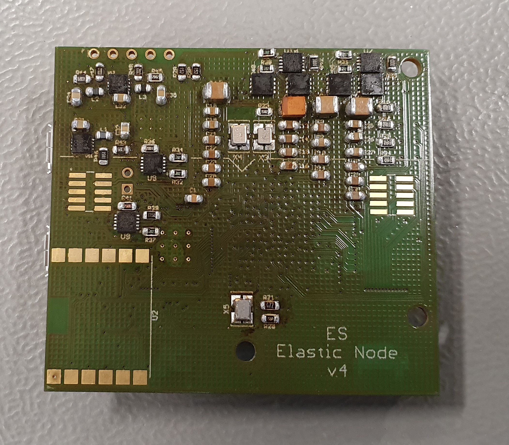
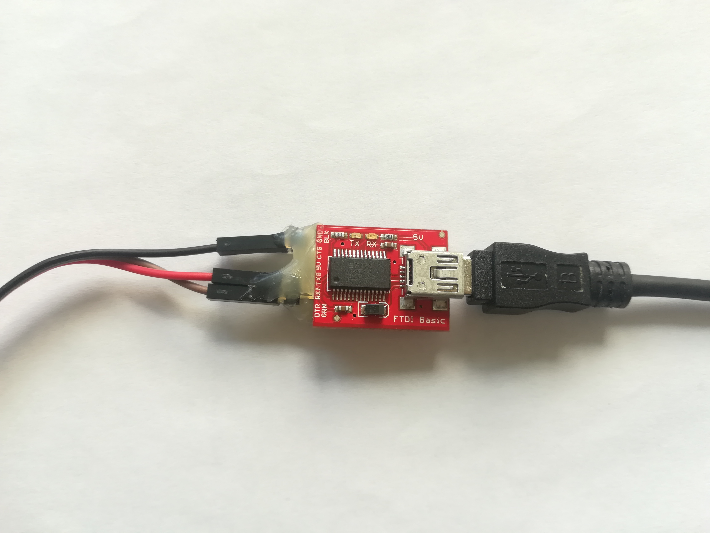

# Getting Started Guide

In the following we explain how to use the elasticnode middleware code.
Therefore, we show how to connect the hardware and how to run a minimal example as well as the needed commands for building and uploading the target.

## Hardware

The following photos show the elasticnode. 
The left yellow rectangle is the FPGA while the right yellow rectangle is the used MCU. 
The left red rectangle at the top shows the FPGA LEDs. 
The right red rectangle at the top shows the MCU LEDs. 
These MCU LEDs should blink in the blink example whereby the FPGA Leds should blink by using the control manager. 
The right red rectangle shows the connection to the MCU via a programmer whereas the right red circle is the connection of the elasticnode MCU to your computer.

The elasticnode is connected to a programmer with 6 jumper wires female to female.
In the following pictures this is the grey cable. 
The connected elasticnode and programmer are shown in the following image.
Please note which jumper wire connect to a pin at the elasticnode is connected to which pin at the programmer.

The programmer is connected with your computer with an USB-to-MiniUSB cable. 
The MiniUSB is connected to the programmer and the USB is connected to your computer.
The elasticnode itself is connected with your computer via an USB-to-MicroUSB cable.
The micro-USB cable is plugged in the elasticnode at the place which is circled red in the first image above.
This place is labeled with MCU_USB. 
The USB is plugged in your computer. 

If you want to communicate via Uart you need a FTDI-adapter.
We don't need this communication, it is only for testing purposes.
This adapter is connected with the elasticnode with 3 jumper wires male to female.
The receive (RXI, brown cable) and transmit (TXD, red cable) pins of the FTDI-adapter are connected with the uart pins.
The ground (GND, black cable) pin of the FTDI-adapter is connected to the ground pin of the elasticnode (see picture above).
The FTDI-adapter has again a connection to the computer like the programmer with a USB-to-MiniUSB cable. 
The MiniUSB is connected to the FTDI-adapter and the USB is connected to your computer.

The following photo shows the construction after connecting the whole hardware.

 
## How to use the Code

After cloning the [elasticnode middleware github repository](https://github.com/es-ude/ElasticNodeMiddleware) and installing [Bazel](https://www.bazel.build/) and the other needed tools, you can run a mini example. 
We implemented two different communication possibilities. 
The first one is the hardware uart implementation via the FTDI-adapter, the second one is the Lufa Usart implementation.
We recommend you to use the Lufa Usart implementation, because it is needed for uploading a bitfile to the FPGA at the elasticnode.
The [Lufa Library](http://www.fourwalledcubicle.com/files/LUFA/Doc/120219/html/index.html) is briefly explained in the [README](../README.md).
Nevertheless we have a mini example for both implementations. 

For using the elasticnodemiddleware code you have to know, which device uses which port.
With Ubuntu you can run

    $ ls /dev

before and after you plug in the devices and the newly added device is the needed port.
In our case the programmer is "ttyACM0", the elasticnode itself is "ttyACM1" and the FTDI-adapter is "ttyUSB0".
If you have different port for the programmer please change the genrule in the [BUILD.bazel](../app/BUILD.bazel) file in the app folder:

    genrule(
        name = "Avr_dude_upload_script",
        outs = ["upload.sh"],
        cmd = """echo "avrdude -c stk500 -p \$$1 -P /dev/ttyACM0 -D -V -U flash:w:\$$2:i -e" > $@""",
    )
    
Change the "/dev/ttyACM0" to the path of your programmer.
If you want to run our implemented integration test you have to change it in the [BAZEL.build](../test/integration/BUILD.bazel) in test/integration, too. 

## Blink Example 

For building the minimal example in the [blinkExample.c](../app/blinkExample.c) you have to run the following command: 

    $ bazel build //app:blinkExample --platforms=@AvrToolchain//platforms:ElasticNode_v4

Thereby is the second word the command (here: "build") and the third word is the path to the file (here: //app:blinkUsartExample), we want to build. 
The leftover command are bazel flags for specializing the platform.  
    
The upload script is specialized in the [BUILD.bazel](../app/BUILD.bazel) in the app folder. 
For running the upload script you have to run: 

	$ bazel run //app:_blinkExampleUpload --platforms=@AvrToolchain//platforms:ElasticNode_v4

Now look at the MCU-Leds at the elasticnode. 
First all leds should be on and turned off after a half second.
After that the leds should be turned on one after one and then should be turned off one after one. 
This last step is repeated infinite. 

## Blink Usart Example

For building the minimal example in the [blinkUsartExample.c](../app/blinkUsartExample.c) you have to run the following command: 

    $ bazel build //app:blinkUsartExample --platforms=@AvrToolchain//platforms:ElasticNode_v4

It is mostly the same like for the [blinkExample](../app/blinkExample.c), but the term "blinkExample" is exchanged with "blinkUsartExample".
You should do the same for the running command.
Therefore the second command should look like this: 

	$ bazel run //app:_blinkUsartExampleUpload --platforms=@AvrToolchain//platforms:ElasticNode_v4

After executing the commands your right MCU_Led (number 4) should blink.
As said above, you have to know which port is used for your connected FTDI-adapter to see the communication.
In our case the port is "ttyUSB0". 
So for seeing the communication you have to use the command:

    $ sudo screen /dev/ttyUSB0 9600

The "9600" is our used baud rate. 
Now you should see perennially string: "Hello. You debug with Uart.", which pops up at the same time as the LED.
When you type a character at your keyboard it should print: "Please press the a on your keyboard." except for the character 'a' and the second LED from the left (number 6) should blink additionally.
For character 'a' it prints "I know you pressed key a." and the second LED from right (number 5) should blink. 
This small example should verify that your uart communication works. 

## Blink Lufa Example

For building and running the blink Lufa Example you have to use the same commands like above but exchange "blinkUsartExample" with "blinkLufaExample".
So, the commands look like this:

    $ bazel build //app:blinkLufaExample --platforms=@AvrToolchain//platforms:ElasticNode_v4
	$ bazel run //app:_blinkLufaExampleUpload --platforms=@AvrToolchain//platforms:ElasticNode_v4

We again use screen for showing the communication. 
But now we open screen with the port of the elasticnode. 
As mentioned before, to determine the port of the elasticnode plug in and out and check in the devices list.
In our case the port of the elasticnode is "ttyACM1".
For printing the communication we use:

    $ sudo screen /dev/ttyACM1
    
By using the Lufa Library, we do not have to specify the baudrate.
Periodically it should be printed "Hello. You debug with Lufa." in the terminal.
Again you can type a key on your keyboard. 
Is the key a character which is not 'a', it is printed: "I know you pressed key a."
Otherwise it prints: "Please press the a on your keyboard."
The right MCU_Led (number 4) should blink all over the time. 

## Uploading the example Bitfile

For uploading our example s15 bitfile you first have to build and run the [main.c](../app/main.c).
For this you have to run the following commands:

    $ bazel build //app:main --platforms=@AvrToolchain//platforms:ElasticNode_v4
 	$ bazel run //app:_mainUpload --platforms=@AvrToolchain//platforms:ElasticNode_v4

Note that the commands are mostly the same like above.
Also note the s15_p1.bit and s15_p2.bit in the project folder [bitfiles](../bitfiles).

As mentioned above you need to know the ports of the programmer and the elasticnode. 
First open the [serial_test.py](../scripts/serial_test.py) file in the scripts folder.
You have to set the "en4_serial_template" to the path of your elasticnode.
Then set the "program_template" to the path of your programmer. 
In our example the elasticnode port is "ttyACM1" and the port of the programmer is "ttyACM0".
Therefore, your declaration of "en4_serial_template" and "program_template" looks like this:

    en4_serial_template = "/dev/ttyACM1"
    program_template = "/dev/ttyACM0"
    
For uploading go into the scripts folder of the project in the terminal and run the following command:

    $ python uploadMultiConfigS15.py
    
This uploads the s15 bitfile.
After processing the last output should be "ready to proceed with uart".
Make sure you use python version 3 instead of python version 2. 

## Use of different elasticnode middleware functions in controlmanager

With our example [main.c](../app/main.c) you can use different functions of the elasticnode after uploading the bitfile. 
They are briefly described in the [README.md](../README.md) in the library "controlmanager".
For using this functions run and build the main like explained in the last section.
After that run 
    
    $ sudo screen /dev/ttyACM1

exactly like in the section "Blink Lufa Example".
Then you can write in the terminal your needed char for your specific function you want to use.
You don't have to write a 'F' because it is automatically done in the python script, you use for your uploading (e.g. uploadMultiConfigS15.py).
If you uploaded the s15 bitfile you can type "L" which should turn on 3 of the 4 FPGA-Leds. 
When you type 'l' they are turned off. 
By typing 'i' you should see the userlogic id.
When you type 'R' and 'r' and use 'i' between this, the id should switch between "D1" and "D2".

The 'R' and 'r' stands for reconfiguration. 
It means you can choose the configuration at the FPGA.
As said above you uploaded two bitfiles.
By using 'R' and 'r' you switch between the two which are both at the FPGA. 
Therefore, you see different userlogic ids.  

## Tests

We write some test for checking the functionalities of our code. 
If you want to run a test of the code (here for example the xmem_Test), you have to run:

    $ bazel test test:xmem_Test

If you want to run all tests:

    $ bazel test test:all
    
If you want to run the integration test you have to use the build and uploads commands as written above.
For example for building the integration test for xmem:

    $ bazel build //test/integration:test_xmem --platforms=@AvrToolchain//platforms:ElasticNode_v4 

and for uploading this integration test

    $ bazel run //test/integration:_test_xmemUpload --platforms=@AvrToolchain//platforms:ElasticNode_v4

The structure of these commands is the same like explained above. 